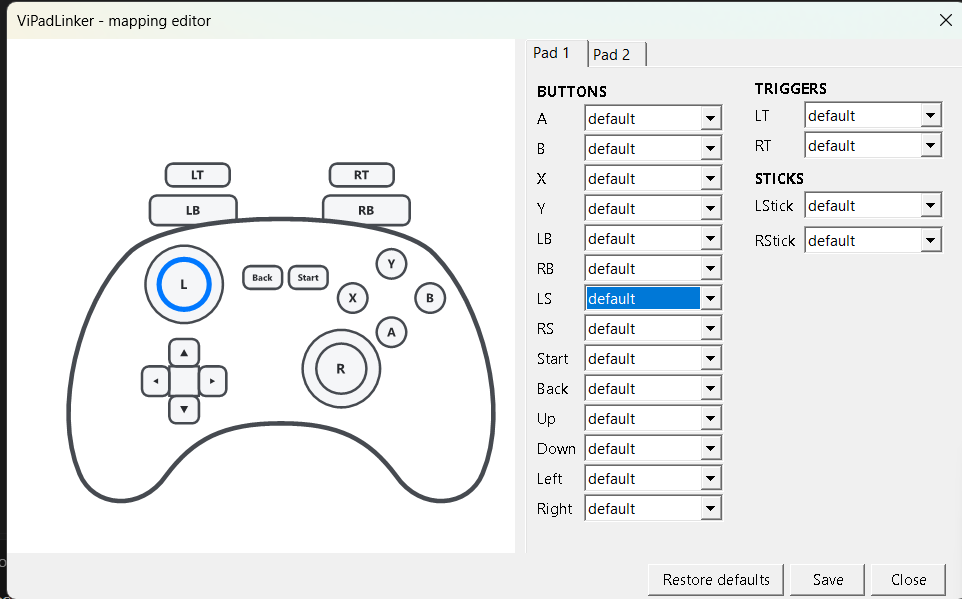
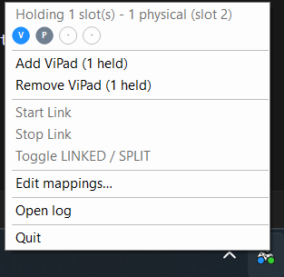
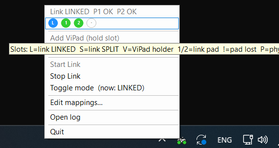

# ViPadLinker

**Two gamepads, one player. Or push a controller to the slot you want.**

A tiny, portable Windows tray tool for XInput controllers. No install, no
config to start — drop it on a USB stick and run it.

<p align="center">
  
</p>

## Why it exists

Born from two frustrations: getting a second controller to work reliably at a
friend's place, and helping my kid learn a game without grabbing the pad out of
their hands. Windows and ViGEmBus already had the pieces — ViPadLinker is the
lightweight front-end that finally put them together.

**[The full story → docs/WHY.md](docs/WHY.md)**

## What it does

- **Pad Link** — combine one or two physical controllers into a single virtual
  pad, so two people can co-op a *single-player* game. Either pad's buttons add
  up (LINKED), or each pad drives one side of the controller (SPLIT).
- **Button remapping** — a visual editor with a clickable gamepad: rewire any
  button, block it, swap the triggers or sticks. Dropdown-only, so it can't
  save a broken config.
- **Slot Holder** — occupy XInput slots to force a physical pad onto the slot
  you want (classic split-screen fix: keep slot 1 for keyboard + mouse).
- **Lives in the tray** — live slot map on the icon, connect/disconnect chimes,
  and a balloon the moment a pad drops out.

<table align="center">
  <tr>
    <td align="center"></td>
    <td align="center"></td>
  </tr>
  <tr>
    <td align="center"><em>Holder mode</em></td>
    <td align="center"><em>Link mode (two pads merged)</em></td>
  </tr>
</table>

## Get started

1. **Install the driver** — download `ViGEmBus_setup.exe` from the
   [official ViGEmBus releases](https://github.com/nefarius/ViGEmBus/releases)
   and run it once per machine (admin required). This is a separate download —
   it is not bundled with ViPadLinker — and it's what lets Windows see the
   virtual pad.
2. **Run `ViPadLinker.exe`** — the icon appears in the system tray.
3. **Click the icon** → *Start Link*, then plug in your pads. Done.

> Needs Windows 10/11 and .NET Framework 4.8 (already on every current Windows).
> Grab the download under [Releases](releases) — it's the whole app in
> three files.

## How it works

```
  pad 1 ─┐
         ├─►  ViPadLinker  ─►  one virtual Xbox 360 pad on slot 1  ─►  game
  pad 2 ─┘        (remap + merge)
```

ViPadLinker sits on top of [ViGEmBus](https://github.com/nefarius/ViGEmBus),
a Windows driver that creates virtual Xbox 360 controllers. The app reads your
physical pads, applies the mapping, and writes one merged virtual pad.

## Documentation

- **[Full manual → docs/README.md](docs/README.md)** — tray reference, the
  mapping editor, use cases, and troubleshooting.
- **[Developer notes → docs/DEVNOTES.md](docs/DEVNOTES.md)** — architecture
  and design decisions.

## Building from source

```
git clone https://github.com/jim-022/ViPadLinker.git
cd ViPadLinker
.\BUILD.bat
```

Needs the [.NET SDK](https://dotnet.microsoft.com/download). Output lands in
`bin\release\`.

## Not a goal

- **No HidHide / device hiding.** Link and Split target *single-player* couch
  co-op — those games read only slot 1 and ignore the physical pads anyway.
- **Not a keymapper for desktop apps.** It maps gamepad-to-gamepad, XInput only.

## License

MIT — see [LICENSE](LICENSE). Big thanks to
[ViGEmBus / ViGEm.Client](https://github.com/nefarius/ViGEmBus) (Benjamin
Hogeboom, MIT) — this tool is a front-end for their driver.
